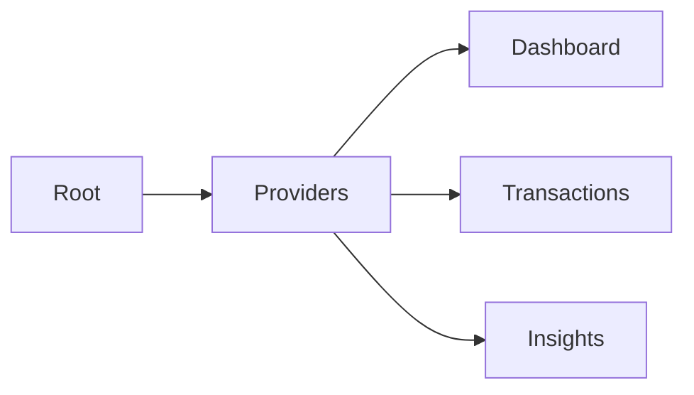

<div align="center">


# FINZO
**Sophisticated Finance Intelligence.**  
*A high-fidelity dashboard for the Zorvyn ecosystem.*

[Live Preview](https://finance-dashboard-client-sigma.vercel.app/) &nbsp;•&nbsp; [Setup](#quick-start)

---

 
 
 


</div>

## The Vision
Finzo transforms financial data into a cohesive visual narrative. Built for performance and aesthetics, it bridges the gap between accounting and design.

### Pillars
- **Analytics**: Real-time balance and spending tracking.
- **Ledger**: High-performance transaction engine.
- **RBAC**: Persistent role-based access control.
- **Design**: Premium dark-mode with glassmorphism.

---

## Tech Stack
- Next.js 15, React 19, Context API
- ApexCharts, Lucide React
- Tailwind CSS v4, Glassmorphism
- LocalStorage Persistence

---

## Architecture


---

## Quick Start
```bash
git clone https://github.com/Mezan2002/finance-dashboard-client
npm install
npm run dev
```

---

<div align="center">

**Mezanur Rahman**  
*Dhaka, Bangladesh*

</div>
