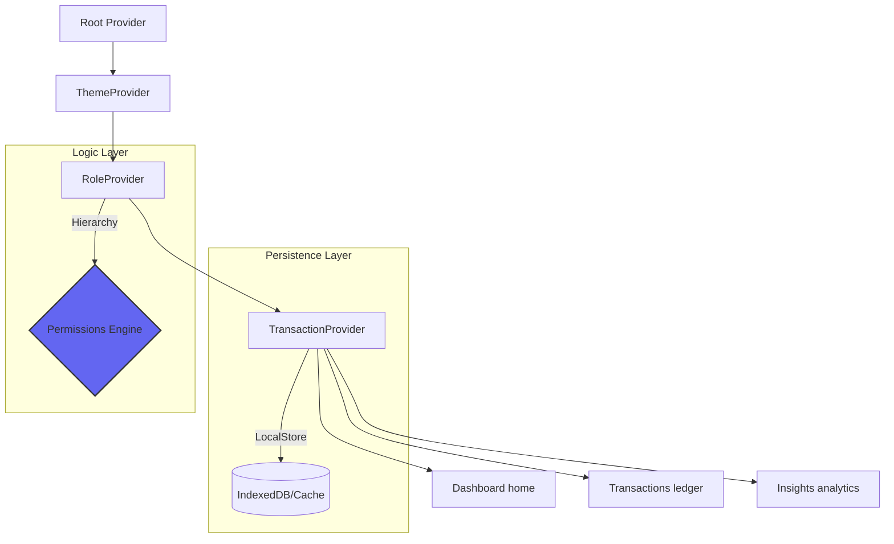

<div align="center">


# 💎 FINZO
**Elevate Your Financial Intelligence.**  
*A high-fidelity, interactive finance suite engineered for the Zorvyn FinTech Ecosystem.*

[Live Demo](https://finance-dashboard-client-sigma.vercel.app/) • [Key Features](#-the-experience) • [Architecture](#-core-architecture) • [Getting Started](#-setup--deployment)

---


</div>

## 🌌 The Experience

**Finzo** isn't just a dashboard; it's a financial cockpit. Built with a focus on modern aesthetics (Glassmorphism, Dark UI) and uncompromising performance, it transforms raw transaction data into actionable financial wisdom.

<div align="center">

| 📊 **Advanced Analytics** | 💼 **Transaction Engine** | 🛡 **Smart RBAC** |
| :--- | :--- | :--- |
| **Balance Velocity**: High-speed area maps showing financial trajectory. | **Live Ledger**: Instant CRUD logic with zero-latency UI synchronization. | **Role Switching**: Seamlessly toggle between Admin and Viewer modes. |
| **Spending ID**: Categorical donut breakdowns for instant budgeting. | **Intelligent Filters**: Search and sort with precision-engineered logic. | **UI Persistence**: Role and preferences persist across sessions via LocalStore. |

</div>

---

## 🛠 Tech Deck

Our technology stack is carefully curated for a premium, low-latency developer and user experience.

<div align="center">

| Category | Tools |
| :--- | :--- |
| **Framework** | Next.js 15 (App Router), React 19 (Server Components ready) |
| **Visuals** | ApexCharts (Interactive Vectors), Lucide Icons (Unified set) |
| **Design** | Tailwind CSS v4, Modern Glassmorphism, CSS Variables mapping |
| **State** | React Context API, Custom Aggregation Hooks, memoized filters |

</div>

---

## 🏗 Core Architecture

The application implements a robust data-flow model where state is managed through a layered Provider hierarchy, ensuring a single source of truth across all financial modules.



---

## 📂 Project Structure

```text
finance-dashboard-client
├── app/                        # Next.js App Router (Layout & Pages)
│   ├── insights/               # Insights analytics page
│   ├── transactions/           # Advanced transaction ledger
│   ├── layout.js               # Root layout & Metadata
│   └── page.js                 # Dashboard overview home
├── components/
│   ├── features/               # Feature-specific logic (Charts, Summaries)
│   ├── shared/                 # Layout components (Header, Sidebar)
│   └── ui/                     # Base UI components (Buttons, Modals)
├── providers/                # Global State (Transaction, Role, Theme Context)
├── hooks/                    # Custom React hooks for data aggregation
├── utils/                    # Data transformation and Export utilities
├── public/                   # Static assets & Fonts
└── tailwind.config.js        # Modern v4 utility configuration
```

---

## 🚦 Setup & Deployment

Deploying Finzo locally is as simple as:

1.  **Clone it**
    ```bash
    git clone https://github.com/Mezan2002/finance-dashboard-client
    ```
2.  **Ignite the dependencies**
    ```bash
    npm install
    ```
3.  **Launch the dev server**
    ```bash
    npm run dev
    ```

Ready for your local cockpit: [http://localhost:3000](http://localhost:3000)

---

## 👨‍💻 Developed By

<div align="center">

**Mezanur Rahman**  
*Lead Frontend Engineer*  
📍 Dhaka, Bangladesh  

[GitHub](https://github.com/Mezan2002) • [LinkedIn](#) • [Portfolio](#)

---

*Designed with ❤️ for the Zorvyn FinTech Frontend Challenge.*

</div>
