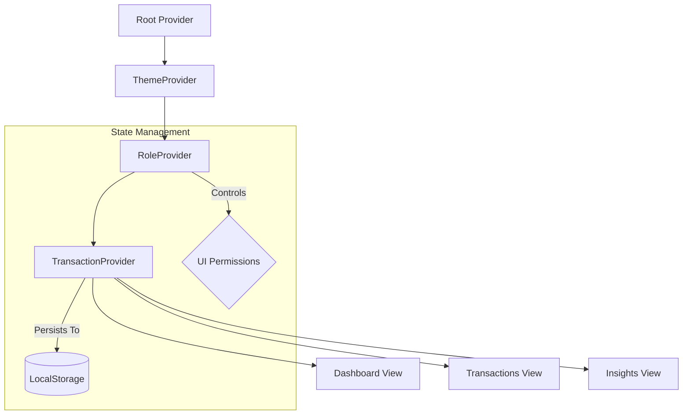

# 💎 Finzo

**The Next-Gen Finance Management Experience.**  
*A high-fidelity, interactive dashboard built for the Zorvyn FinTech Frontend Challenge.*

---

<p align="center">
  <a href="#-live-demo">Live Demo</a> •
  <a href="#-key-features">Features</a> •
  <a href="#-tech-stack">Tech Stack</a> •
  <a href="#-architecture">Architecture</a> •
  <a href="#-getting-started">Setup</a>
</p>

---

## 🚀 Overview

**Finzo** is a premium finance dashboard designed to provide users with deep insights into their financial health. It combines sophisticated data visualization with a seamless user experience, featuring real-time transaction management and intelligent spending observations.

> [!IMPORTANT]
> **Role-Based Access:** This application features a simulated RBAC system. Switch between **Admin** (Full CRUD) and **Viewer** (Read-Only) modes via the profile dropdown in the header.

---

## 🔗 Assignment & Live Links

> - **Assignment Portal:** [screening.zorvyn.io](https://screening.zorvyn.io/)
> - **GitHub Repository:** [github.com/Mezan2002/finance-dashboard-client](https://github.com/Mezan2002/finance-dashboard-client)
> - **Live Demo (Vercel):** [https://finance-dashboard-client-sigma.vercel.app/](https://finance-dashboard-client-sigma.vercel.app/)

---

## 🛠 Tech Stack

| Core | Visualization | Styling | Infrastructure |
| :--- | :--- | :--- | :--- |
| **Next.js 15** (App Router) | **ApexCharts** | **Tailwind CSS v4** | **Vercel** |
| **React 19** | **Lucide React** | **Glassmorphism UI** | **LocalStorage Persistence** |

---

## ✨ Key Features

### 📊 Intelligence & Analytics
- **Dynamic Summaries**: Real-time tracking of Balance, Income, Expenses, and Savings metrics.
- **Balance Velocity**: High-performance interactive area charts visualizing financial growth trends.
- **Spending Fingerprint**: Donut charts for categorical expense distribution and insights.
- **Smart Insights**: Data-driven observations for spending spikes and savings efficiency.

### 💼 Transaction Management
- **Full CRUD Engine**: Add, Edit, and Delete transactions with instant UI synchronization.
- **Precision Filtering**: Search by merchant, filter by category, or isolate specific date ranges.
- **Data Portability**: Export your financial ledger to **CSV** or **JSON** formats instantly.

### 🛡 Security & UX
- **RBAC Simulation**: Context-aware UI that hides administrative controls for the Viewer role.
- **Theme Engine**: System-aware Dark/Light mode with a premium high-contrast palette.
- **Responsive Core**: A mobile-first design featuring a native-feeling drawer navigation.

---

## 🏗 Architecture

The application utilizes a centralized state management pattern via React Context to ensure data consistency across all views.



---

## 📂 Project Structure

```text
finance-dashboard-client
├── app/                        # Next.js App Router (Layout & Pages)
│   ├── insights/               # Insights analytics page
│   ├── transactions/           # Advanced transaction ledger
│   ├── layout.js               # Root layout & Metadata
│   └── page.js                 # Dashboard overview home
├── components/
│   ├── features/               # Feature-specific logic (Charts, Summaries)
│   ├── shared/                 # Layout components (Header, Sidebar)
│   └── ui/                     # Base UI components (Buttons, Modals)
├── providers/                # Global State (Transaction, Role, Theme Context)
├── hooks/                    # Custom React hooks for data aggregation
├── utils/                    # Data transformation and Export utilities
├── public/                   # Static assets & Fonts
└── tailwind.config.js        # Modern v4 utility configuration
```

---

## 🚦 Getting Started

1. **Clone the repository**
   ```bash
   git clone https://github.com/Mezan2002/finance-dashboard-client
   cd finance-dashboard-client
   ```

2. **Install dependencies**
   ```bash
   npm install
   ```

3. **Run the development server**
   ```bash
   npm run dev
   ```

Next.js will print a local URL, for example:
- [http://localhost:3000](http://localhost:3000)

---

## 👨‍💻 Author

**Mezanur Rahman**  
*Frontend Developer*  
📍 Dhaka, Bangladesh  

[GitHub](https://github.com/Mezan2002) • [LinkedIn](#) • [Portfolio](#)

---

<div align="center">
  <p>Built and designed with ❤️ by <strong>Mezanur Rahman</strong> &copy; 2026</p>
  
</div>
