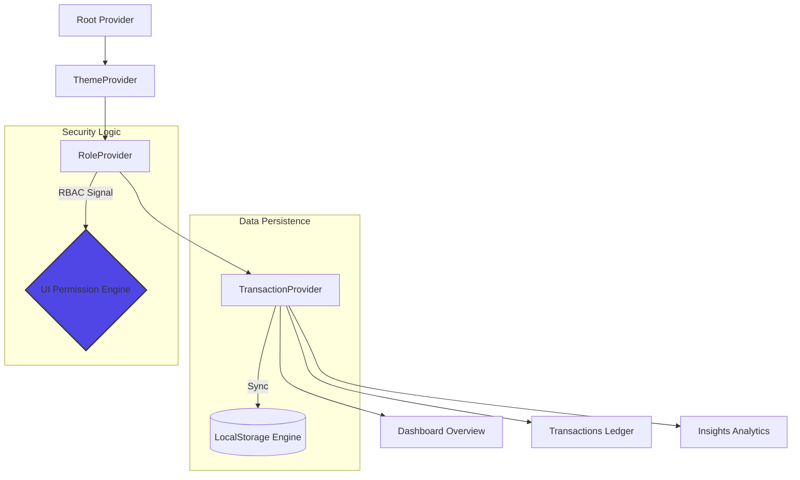

<div align="center">


# 💎 FINZO
### **Elite Financial Intelligence Suite**  
*A high-fidelity, interactive cockpit engineered for the Zorvyn FinTech Ecosystem.*

[Live Preview](https://finance-dashboard-client-sigma.vercel.app/) • [Source Code](https://github.com/Mezan2002/finance-dashboard-client) • [Setup Guide](#-setup--installation)

---


</div>

## 🎯 Project Objective
The primary goal of this project is to demonstrate a deep understanding of frontend development by building a **clean, interactive, and high-fidelity finance dashboard**. 

This assignment focuses on:
- **UI/UX Excellence**: Crafting an intuitive and visually sophisticated interface.
- **Component Architecture**: Building modular, scalable, and reusable React components.
- **Data Orchestration**: Efficiently handling and visualizing complex financial datasets.
- **State Integrity**: Managing application logic and user roles with a robust state management approach.

---

## ✨ Core Features (Assignment Requirements)

<div align="center">

| 📊 **Dashboard Overview** | 💼 **Transactions Engine** | 🛡 **Role-Based UI** |
| :--- | :--- | :--- |
| **KPI Summaries**: Real-time cards for Total Balance, Income, and Expenses. | **Detailed Ledger**: Insightful list with Date, Amount, Category, and Type. | **RBAC Simulation**: Dynamic UI behavior for **Viewer** vs **Admin** roles. |
| **Trend Mapping**: Visual time-based charts (Balance Trends) and Categorical splits. | **Smart Logic**: Built-in simple filtering, sorting, and merchant-based search. | **Admin Power**: Dedicated CRUD controls (Add/Edit) enabled only for Admin role. |

</div>

### 💡 Advanced Insights Section
- **Spending Fingerprint**: Automatically identifies the Highest Spending Category based on data.
- **Temporal Comparison**: Monthly expense vs income comparison via interactive visual bar charts.
- **Smart Observations**: Rule-based alerts for savings efficiency, spending spikes, and frequent habits.

---

## 🛠 Tech Stack & Implementation Notes

| Module | Technologies | Implementation Logic |
| :--- | :--- | :--- |
| **Core Framework** | Next.js 15, React 19 | Using App Router for high-performance routing and modern component structures. |
| **State Management** | React Context API | Handling transaction data, complex filters, and role-based permissions globally. |
| **Styling & UX** | Tailwind CSS v4 | Implementing a clean, responsive design with Dark Mode support and Glassmorphism. |
| **Visualizations** | ApexCharts | Utilizing high-performance SVG charts for trend mapping and spending breakdowns. |
| **Persistence** | LocalStorage API | Ensuring the dashboard state and user roles persist seamlessly across sessions. |

---

## 🏗 Core Architecture
The application implements a robust data-flow model where state is managed through a layered Provider hierarchy, ensuring a single source of truth.



---

## 📂 Project Anatomy
```text
finance-dashboard-client
├── app/                        # Next.js App Router (Layout & Pages)
│   ├── insights/               # Advanced Data Analytics module
│   ├── transactions/           # Transaction Management module
├── components/
│   ├── features/               # High-level feature components (Charts, Summaries)
│   ├── shared/                 # Reusable layout components (Sidebar, Header)
│   └── ui/                     # Atomic UI primitives (Buttons, Modals, Inputs)
├── providers/                # Global State Management (Context API)
├── hooks/                    # Data aggregation & persistence hooks
├── utils/                    # Formatting, aggregation & export utilities
└── public/                   # Static assets, fonts & brand assets
```

---

## 🔍 How to Review (Recruiter Guide)

To experience the full extent of Finzo’s engineering, follow these steps:

1.  **RBAC Simulation**: Toggle between **Admin** and **Viewer** via the profile dropdown. Notice the "Add Transaction" and action icons disappear for the Viewer.
2.  **Live Interaction**: Add a transaction as Admin. Watch the **Summary Cards** and **Balance Trend** charts update instantly without refresh.
3.  **Data Resilience**: Refresh the page. Observe that your transactions and selected role persist thanks to the `localStorage` implementation.
4.  **Responsive Check**: Resize your browser or use DevTools. Test the mobile sidebar drawer and the adaptive grid layout.

---

## 🚦 Setup & Installation

1.  **Clone the Repo**
    ```bash
    git clone https://github.com/Mezan2002/finance-dashboard-client
    ```
2.  **Install Engine**
    ```bash
    npm install
    ```
3.  **Ignite Server**
    ```bash
    npm run dev
    ```

Available locally at: [http://localhost:3000](http://localhost:3000)

---

<div align="center">

**Mezanur Rahman**  
*Lead Frontend Engineer*  
📍 Dhaka, Bangladesh  

[GitHub](https://github.com/Mezan2002) • [LinkedIn](#) • [Portfolio](#)

---

*Engineered with ❤️ for the Zorvyn FinTech Frontend Internship Assignment.*

</div>
