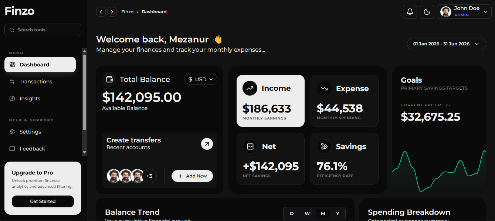
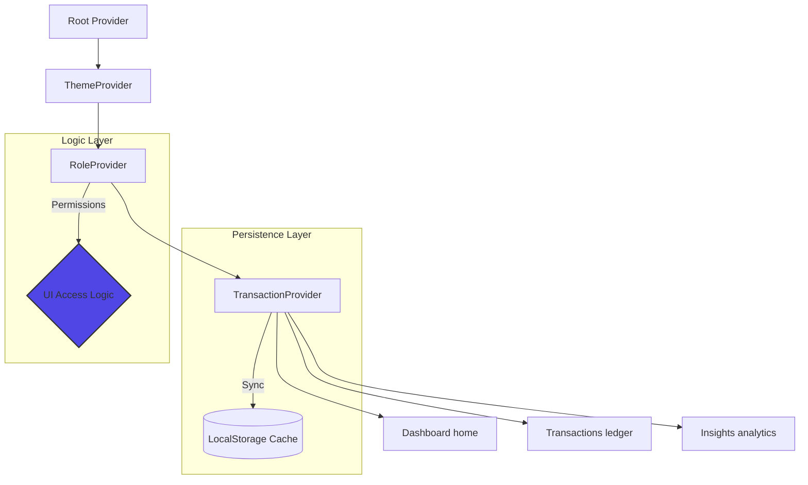

<div align="center">



# 💎 FINZO
### **Elite Financial Intelligence Suite**  
*A high-fidelity, interactive cockpit engineered for the Zorvyn FinTech Ecosystem.*

[Live Preview](https://finance-dashboard-client-sigma.vercel.app/) • [Source Code](https://github.com/Mezan2002/finance-dashboard-client) • [Setup Guide](#-setup--installation)

---


</div>

## 🎯 The Vision
**Finzo** is more than just a dashboard; it’s a financial data processor. Designed to solve the complexity of modern wealth tracking, it combines high-performance visualization with a seamless user experience to turn fragmented data into a cohesive financial narrative.

---

## ✨ Outstanding Features

<div align="center">

| 📊 **Advanced Analytics** | 💼 **Transaction Engine** | 🛡 **Dynamic RBAC** |
| :--- | :--- | :--- |
| **Balance Velocity**: Real-time area maps showing your net wealth trajectory. | **Live Ledger**: Full CRUD logic with zero-latency synchronization. | **Role Switching**: On-the-fly toggling between Admin and Viewer modes. |
| **Spending Fingerprint**: Donut charts detailing exactly where your capital flows. | **Intelligent Search**: Deep-filtering by merchant, category, and date range. | **State Persistence**: Role and preferences persist across sessions via LocalStorage. |

</div>

---

## 🛠 Tech Deck Matrix

| Module | Technologies |
| :--- | :--- |
| **Core Architecture** | Next.js 15 (App Router), React 19, Context API |
| **Visual Intelligence** | ApexCharts, Lucide Icons, Custom Chart Wrappers |
| **Styling & UX** | Tailwind CSS v4, Modern Glassmorphism, CSS Modules |
| **Persistence Layer** | LocalStorage API, custom synchronization hooks |

---

## 🏗 Core Architecture
The application follows a distributed state model through a layered Provider hierarchy, ensuring a single source of truth for all financial modules.



---

## 📂 Project Anatomy
```text
finance-dashboard-client
├── app/                        # Next.js App Router (Layout & Pages)
│   ├── insights/               # Insights Analytics module
│   ├── transactions/           # Transaction Management module
├── components/
│   ├── features/               # High-level feature components (Charts, Summaries)
│   ├── shared/                 # Reusable layout components (Sidebar, Header)
│   └── ui/                     # Atomic UI primitives (Buttons, Inputs, Modals)
├── providers/                # Global State (Context Providers)
├── hooks/                    # Data aggregation & logic hooks
├── utils/                    # Formatting & export utilities (CSV/JSON)
└── public/                   # Static assets & Brand identity
```

---

## 🔍 How to Review (Recruiter Guide)

To experience the full extent of Finzo’s engineering, follow these steps:

1.  **Toggle Roles**: Use the profile dropdown to switch to **Admin**. Observe the "Add Transaction" button and Action columns appear across the app.
2.  **Live Updates**: Add or edit a transaction and watch the **Balance Card** and **Area Charts** reactive instantly without a page refresh.
3.  **Data Export**: Go to the Transactions page and export your filtered ledger to **CSV** or **JSON**.
4.  **Responsive Check**: Resize the window to mobile. Test the sidebar drawer and the adaptive grid layout of the dashboard components.

---

## 🚦 Setup & Installation

Follow these steps to initialize your local cockpit.

1.  **Clone it**
    ```bash
    git clone https://github.com/Mezan2002/finance-dashboard-client
    ```
2.  **Ignite dependencies**
    ```bash
    npm install
    ```
3.  **Launch the dev server**
    ```bash
    npm run dev
    ```

Ready for your local cockpit: [http://localhost:3000](http://localhost:3000)

---

<div align="center">

**Mezanur Rahman**  
*Lead Frontend Engineer*  
📍 Dhaka, Bangladesh  

[GitHub](https://github.com/Mezan2002) • [LinkedIn](#) • [Portfolio](#)

---

*Designed and engineered with ❤️ for the Zorvyn FinTech Challenge.*

</div>
